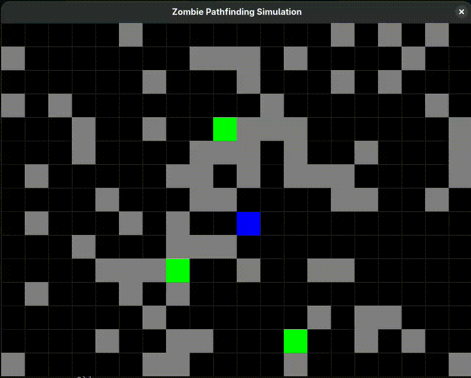

# Proof of concept: Grid-based Horde Simulation with BFS Pathfinding
A proof of concept 2D game developed in Python with Pygame. This project demonstrates the implementation of the **Breadth First Search (BFS)** algorithm to create a dynamic pathfinding AI for a zombie horde that chases the player on a grid-based map with randomly generated obstacles.

## About the project
The goal of this project is to be a practical demonstration of how graph transversal algorithms can be applied to solve complex AI navigation problems in real-time. The simulation creates an environment where a user-controlled player must survive against zombies that use BFS to calculate the shortest path to the player while avoiding obstacles.

## Features
The game features **player movement**, with WASD keys, AI with **BFS pathfinding**, random **obstacle generation** and **state management** with game over condition.

## Implemented Concepts
* **Graph data structure**: The map is represented as a graph, where each tile is a node and adjacent connections are the edges.
* **BFS Algorithm**: Used to calculate the shortest path from a zombie to the player.
* **Game AI**: Reactive AI based on perception (player's position) and navigation (pathfinding).
* **Game Loop and Event Handling**: Usage of the main Pygame loop to process user input, update game logic, and render graphics each frame.

## How to run
### Prerequisites
* **Python 3**;
* **pip** (Python package manager).

### Installation
1. Clone the repo:
```bash
git clone https://github.com/yanrdgs-dev/bfs-horde.git
```
2. Navigate to the project directory:
```bash
cd bfs-horde
```
3. Install the pygame library:
```bash
pip install pygame
```

### How to play
To start the game, run the main file:
```bash
python game.py
```
To play, use the **WASD** keys to move, and run from the zombies for as much time as possible while avoiding the obstacles.

## Future Improvements
For future improvements, it would be nice to implement the **A*** (A-Star) algorithm and compare its performance with BFS, and to add a scoring system. Also, improving the graphics would be nice (not a main priority, though).

## Considerations
After implementing, it was clear that the implementation was slow. If there isn't a cooldown on player movement, it doesn't even give the program enough time to process the pathfinding and move the zombies.

## Contribution
Contribution is welcome! Contribute through an issue or an pull request.